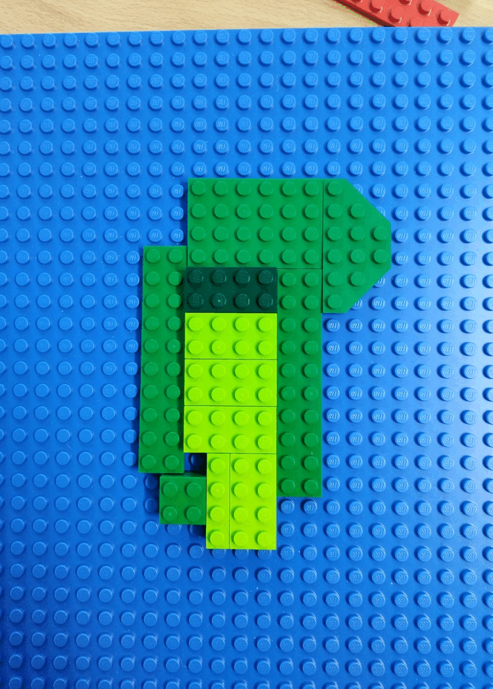

As part of the Research Communication program, Mastering the Art of Research Communication: Develop your Skills! by the University of Nottingham’s Research Academy, we had the opportunity to disseminate our projects using non-conventional resources to change mindsets and encourage creativity. It was enjoyable to revisit LEGO — now to continue exploring new ways to share research. We are working to produce a worker-informed, data-driven climate risk and vulnerability assessment (CRVA) for agricultural workers in Brazil. Each coloured LEGO layer represents a vital piece of the puzzle: climate data, socioeconomic conditions, and workers’ voices. By applying a multi-layer risk assessment, the project will provide insights into the relationship between climate change, workers’ health, and decent work. A big thank you to Andrew Rowe for introducing such a great initiative.
 
Sorry for the terrible map, but I ran out of time and green blocks 😅
 

{fig-align="center"}
