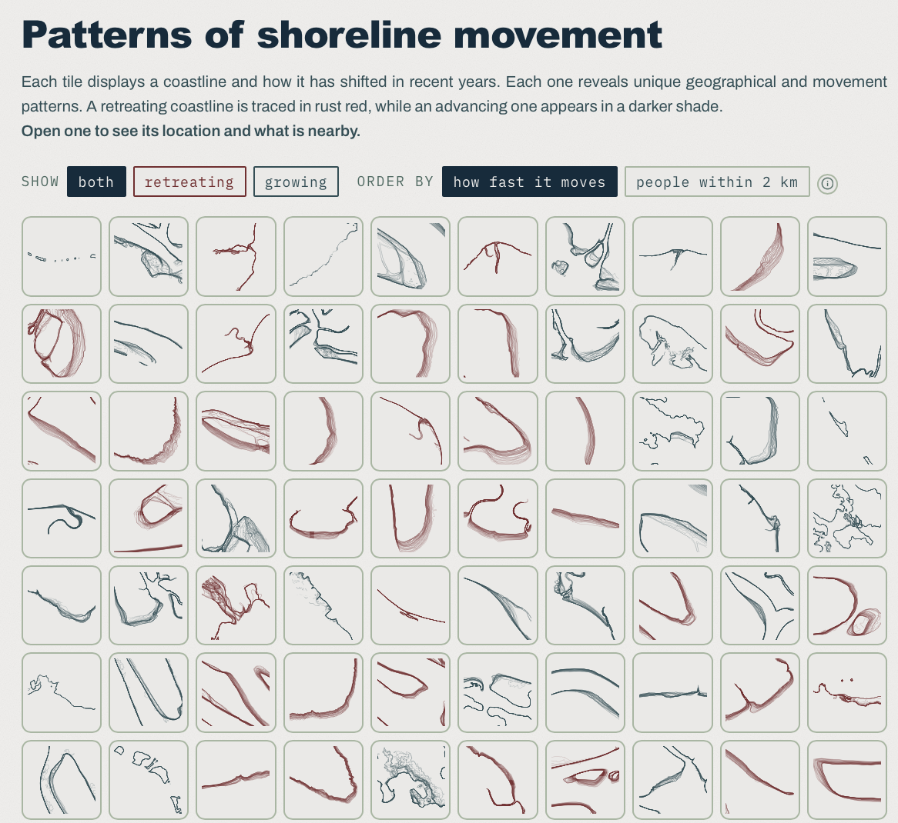

[← Back to Portfolio](../../portfolio.html){.back-link}

::: {.label}
Interactive · Scrollytelling · Pacific Dataviz Challenge 2026 · 1999–2023
:::

An entry to the Pacific Dataviz Challenge 2026. It asks how Pacific coastlines have moved over the last quarter century, and who lives on the stretches that are retreating.

On balance the region is down about 51 km² between 1999 and 2023, roughly twice the size of Tuvalu. That net figure hides two much bigger ones: about 373 km² taken by retreat and 322 km² added by growth. Sand building up on one coast does not give back what another has lost, so the story counts gross retreat as well as the net change.

## What's in it

Six short chapters. The first covers how much land is gone and why the net figure hides most of it. The second asks where the retreat comes from. Papua New Guinea loses the most land and also has the largest share of its coast in retreat, but further down, ranking by share of coastline gives a different order than ranking by area. The third is about people: about 940,000, or 7.2% of the population, live where the coast is retreating, and about 25,000 where it retreats faster than 5 metres a year. The last three present selected shorelines and their patterns, a map where picking a territory narrows every chart to it, and notes on how the site was made.

## How it was measured

Digital Earth Pacific places a point every 30 metres along the 2023 shoreline, each with a rate of change in metres per year. Multiplying that rate by the 24-year record and by the 30 metres of coast each point stands for gives an area. Only points that pass the quality filter count: 1.35 million of 2.06 million, covering 40,477 km of the 61,712 km of coast in the record.

## Data

Shorelines and rates of change come from Digital Earth Pacific Coastlines v0.7.0-55, built from Landsat imagery, with annual shorelines from 1999 to 2023. Population is WorldPop 2020 (constrained, 100 m grid). Sea borders are PacIOOS Pacific Island EEZ boundaries, place names come from OpenStreetMap and aerial imagery from Esri World Imagery. The header photograph is from *The Fabric of Life: Early Polynesian barkcloth in context* (National Museums Scotland).

## The build

A plain web page with no front-end framework and no build step. An R pipeline (sf, terra, DuckDB, dplyr) reduces the source archives to one `stats.json`, a few GeoJSON layers and PMTiles archives. The charts are SVG drawn in JavaScript straight from that `stats.json`, the maps use MapLibre GL JS, and httpuv, an R web server, serves the files. QGIS was used for a first look at the record and for the supporting figures. Coding was assisted by Claude Code.

## Visit

[pacific-dataviz-challengue-2026.vercel.app](https://pacific-dataviz-challengue-2026.vercel.app)

{width=100%}
